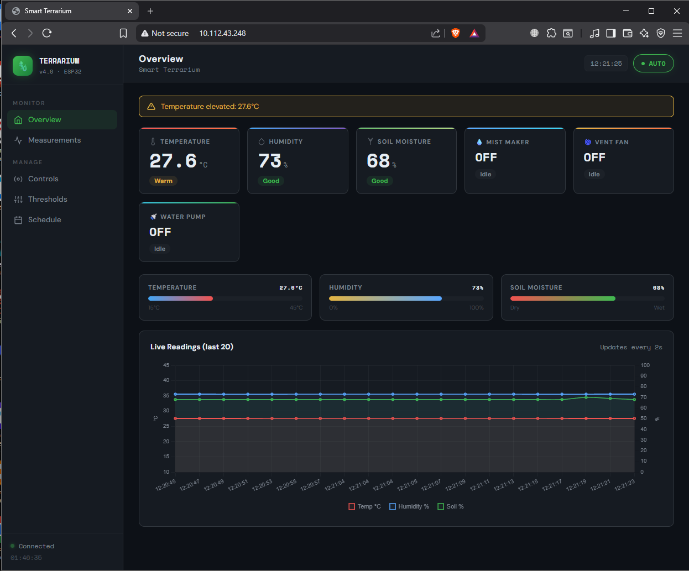
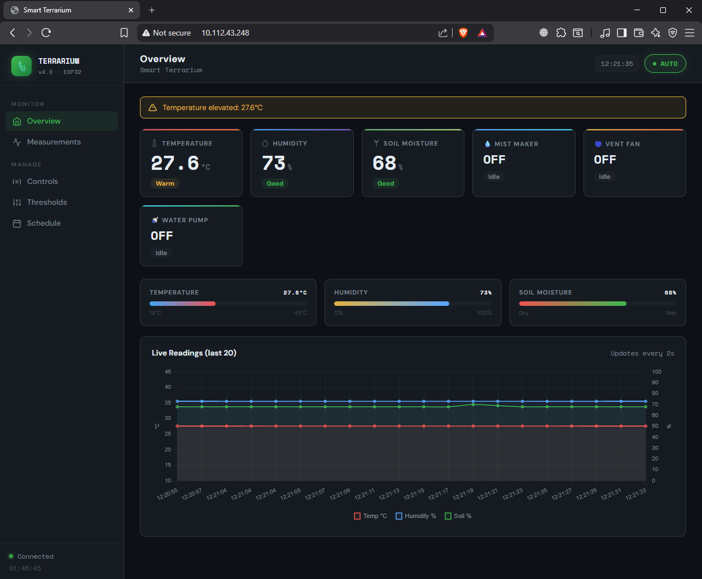
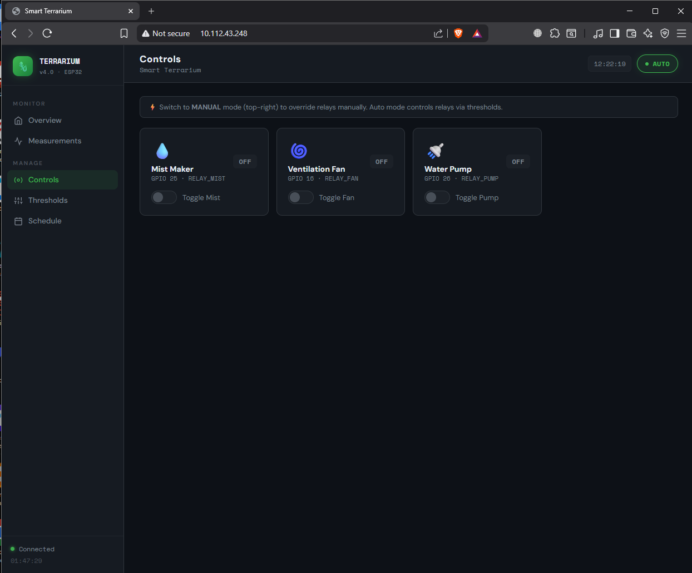
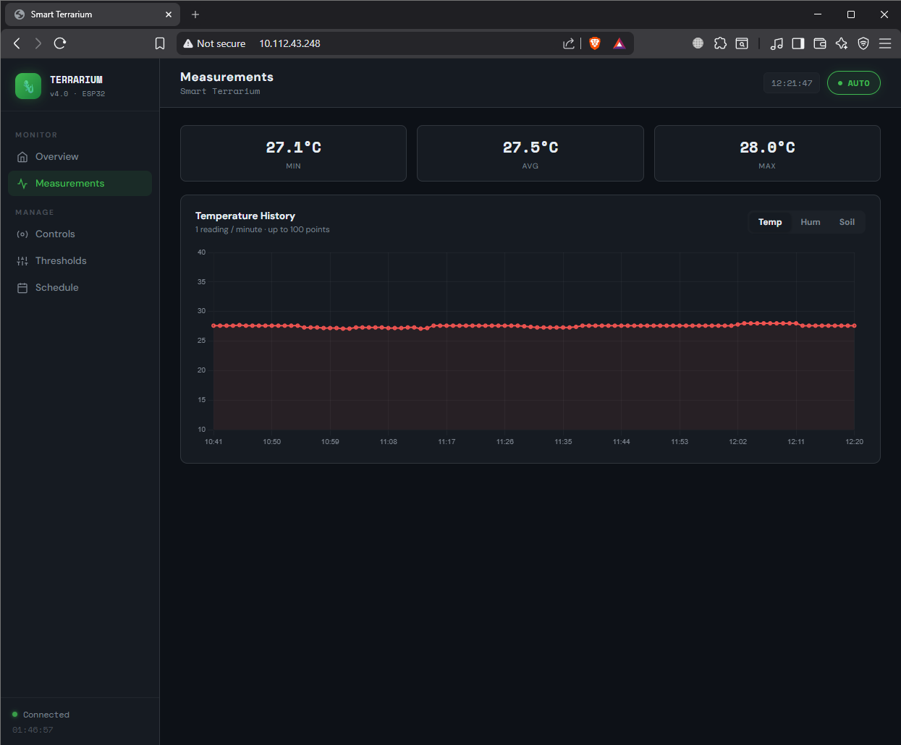
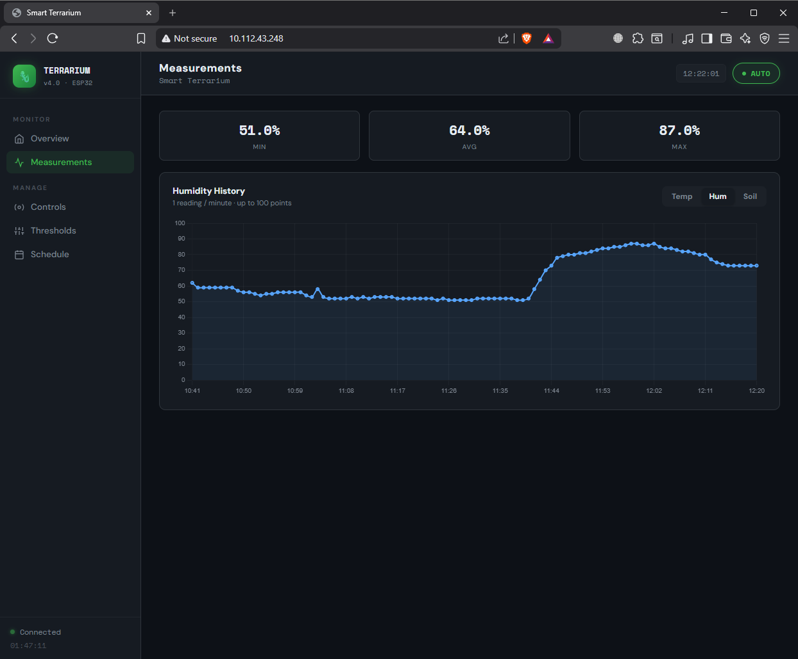
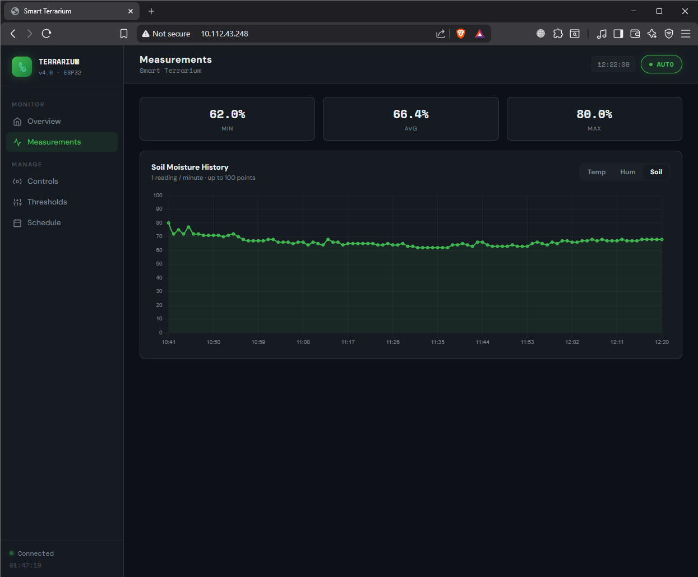
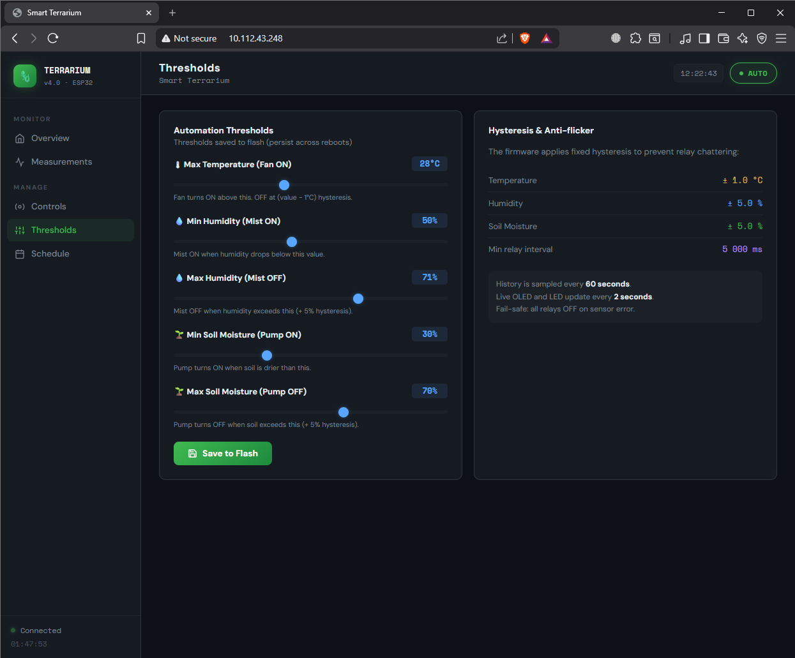
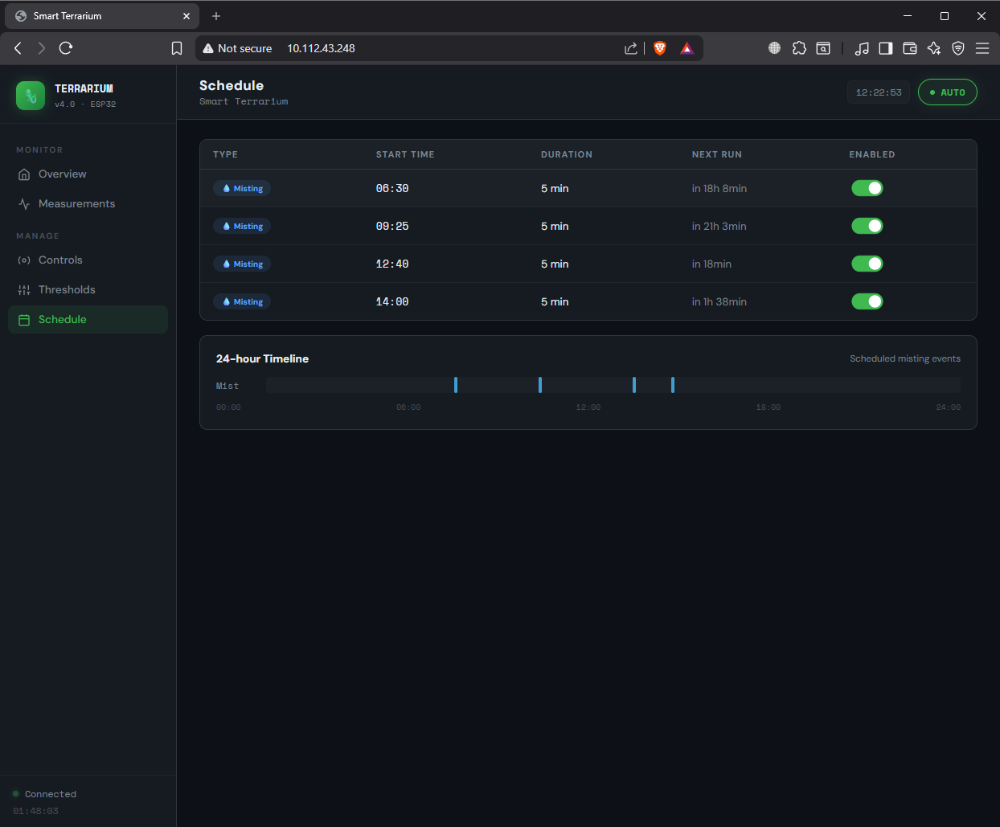

# 🌿 Smart Terrarium — ESP32

> An automated terrarium controller built with ESP32, featuring real-time sensor monitoring, a web dashboard, auto/manual relay control, NeoPixel lighting, and scheduled misting — all in one compact device.

<p align="center">
  
</p>

---

## 📖 What Is This?

This project turns a regular terrarium into a smart, self-maintaining environment for plants or reptiles. An ESP32 reads temperature, humidity, and soil moisture, then automatically controls a mist maker, ventilation fan, and water pump to keep everything in the ideal range.

You can monitor and control everything from a browser on your phone or computer — no app install needed.

---

## ✨ Features

- 🌡️ **Live sensor readings** — temperature (DHT11), humidity (DHT11), soil moisture (analog)
- 💧 **3 relay outputs** — Mist Maker, Ventilation Fan, Water Pump
- 🤖 **Auto mode** — relays switch on/off automatically based on your thresholds
- 🕐 **Scheduled misting** — set up to 10 timed mist events per day
- 📊 **Web dashboard** — real-time charts, history graphs, relay toggles, threshold editor
- 💡 **NeoPixel ring (12 LEDs)** — ambient colour shows system status at a glance
- 🖥️ **OLED display** — shows sensor values and relay states without a phone
- ⚡ **OTA (Over-the-Air) firmware updates** — update the code over WiFi, no USB needed
- 💾 **Persistent settings** — thresholds and mode survive power cycles
- 🔘 **Physical button** — short press toggles auto/manual; long press = emergency stop

---

## 🛠️ Hardware You Need

| Component | Details |
|---|---|
| ESP32 dev board | Any 30-pin board works |
| DHT11 sensor | Temperature + humidity |
| Soil moisture sensor | Capacitive or resistive, analog output |
| SSD1306 OLED display | 128×64, I²C |
| NeoPixel LED ring | 12 LEDs, WS2812B |
| 3-channel relay module | 5V, active-HIGH |
| Mist maker / ultrasonic atomiser | 5V or 12V |
| Mini water pump | For soil watering |
| Ventilation fan | 5V or 12V |
| Push button | Momentary, normally open |
| Power supply | 5V or 12V depending on your actuators |

---

## 🔌 Wiring

Connect everything to the ESP32 as follows:

| Signal | ESP32 Pin |
|---|---|
| DHT11 data | GPIO 2 |
| Soil sensor (analog out) | GPIO 36 (ADC1_CH0) |
| Button | GPIO 14 (uses internal pull-up) |
| Relay — Mist Maker | GPIO 25 |
| Relay — Ventilation Fan | GPIO 27 |
| Relay — Water Pump | GPIO 26 |
| NeoPixel data | GPIO 15 |
| OLED SDA | GPIO 5 |
| OLED SCL | GPIO 4 |

> **Note:** All relay outputs are active-HIGH. Connect the relay module's IN pins directly to the GPIO pins listed above.

---

## ⚙️ Software Setup

### 1. Install Arduino IDE and the ESP32 board package

Follow the official guide: [ESP32 Arduino Core](https://docs.espressif.com/projects/arduino-esp32/en/latest/installing.html)

### 2. Install the required libraries

Open **Sketch → Include Library → Manage Libraries** and install:

| Library | Version tested |
|---|---|
| `Adafruit SSD1306` | 2.5.x |
| `Adafruit GFX Library` | 1.11.x |
| `DHT sensor library` (Adafruit) | 1.4.x |
| `Adafruit NeoPixel` | 1.11.x |
| `ArduinoJson` | 6.x |

The following libraries come with the ESP32 board package and don't need separate installation: `WiFi`, `WebServer`, `ArduinoOTA`, `Preferences`.

### 3. Configure your WiFi credentials

Open `code/terrarium.ino` and update these two lines near the top:

```cpp
const char* WIFI_SSID = "YourNetworkName";
const char* WIFI_PASS = "YourPassword";
```

If you're not in India, also update the timezone offset (in seconds from UTC):

```cpp
const long GMT_OFFSET = 19800;  // IST = UTC+5:30  →  change to match your zone
```

### 4. Flash the ESP32

1. Connect the ESP32 via USB
2. Select your board: **Tools → Board → ESP32 Dev Module**
3. Select the correct COM port
4. Click **Upload**

### 5. Open the dashboard

1. Open the Serial Monitor at 115200 baud
2. Wait for the IP address to appear (e.g. `[WiFi] IP: 192.168.1.42`)
3. Type that address into any browser on the same network

> After the first flash you can update firmware wirelessly via **Sketch → Upload Using Programmer → OTA** — the device shows up as `terrarium-esp32`.

---

## 📟 OLED Display

The OLED cycles between two screens every 4 seconds:

| Screen | Shows |
|---|---|
| Page 1 | Temperature, Humidity, Soil moisture (with progress bar) |
| Page 2 | Relay states (Mist / Fan / Pump), WiFi status |

A mode indicator (`[AUTO]` or `[MANU]`) appears in the top corner at all times.

---

## 💡 NeoPixel Colour Guide

The 12 LEDs give you a quick at-a-glance status without looking at a screen:

| Colour | Meaning |
|---|---|
| 🟣 Purple | System is OK — all readings in range |
| 🔵 Blue (pixels 0–1) | Mist maker is ON |
| 🟠 Orange (pixels 4–5) | Fan is ON |
| 🩵 Cyan (pixels 8–9) | Pump is ON |
| 🔴 Red | Sensor error — check DHT11 |
| 🔵 Blue (ambient) | Soil is too dry |
| 🟢 Green | Soil is too wet |
| 🟠 Orange (ambient) | Temperature is too high |

---

## 🔘 Physical Button

| Press | Action |
|---|---|
| Short press | Toggle between Auto and Manual mode |
| Long press (2 s+) | Emergency stop — all relays turn OFF immediately |

---

## 🌐 Web Dashboard

Type the ESP32's IP address into any browser to open the dashboard. No app or internet connection needed — it runs entirely on the device.

<p align="center">
  
  <br><em>Main dashboard — live sensor cards update every 2 seconds</em>
</p>

<p align="center">
  
  <br><em>Overview panel showing all sensor and relay status</em>
</p>

<p align="center">
  
  <br><em>Manual relay control panel — toggle Mist, Fan, and Pump individually</em>
</p>

### Sensor History Charts

<p align="center">
  
  <br><em>Temperature history — one data point per minute, last 100 readings</em>
</p>

<p align="center">
  
  <br><em>Humidity history chart</em>
</p>

<p align="center">
  
  <br><em>Soil moisture history chart</em>
</p>

### Threshold Settings

<p align="center">
  
  <br><em>Set your ideal ranges — values are saved to flash and survive power cuts</em>
</p>

### Scheduled Misting

<p align="center">
  
  <br><em>Schedule up to 10 daily misting events with custom duration</em>
</p>

---

## 📷 It Working in Real Life

<p align="center">
  
  <br><em>The complete setup running — OLED lit, NeoPixels on</em>
</p>

<p align="center">
  
  &nbsp;&nbsp;
  
  <br><em>Left: temperature reading on the OLED &nbsp;|&nbsp; Right: humidity reading</em>
</p>

<p align="center">
  
  &nbsp;&nbsp;
  
  <br><em>Left: soil moisture sensor in action &nbsp;|&nbsp; Right: threshold display</em>
</p>

---

## 🖨️ 3D Printed Parts

The `3D_files/` folder contains an STL file for a custom **Aromizer housing** (`Aromizer.stl`) that mounts the ultrasonic mist maker neatly inside the terrarium.

---

## 📡 REST API Reference

The ESP32 exposes a simple JSON API, useful if you want to integrate it with Home Assistant or build your own UI.

| Method | Endpoint | Description |
|---|---|---|
| `GET` | `/api/live` | Current sensor readings and relay states |
| `GET` | `/api/history` | Last 100 readings (1 per minute) |
| `GET` | `/api/thresholds` | Current threshold values |
| `POST` | `/api/thresholds` | Update threshold values |
| `POST` | `/api/relay` | Turn a relay on/off (manual mode only) |
| `POST` | `/api/mode` | Switch between auto and manual mode |
| `GET` | `/api/events` | List scheduled misting events |
| `POST` | `/api/events` | Add or update a misting event |

**Example — read live data:**
```bash
curl http://192.168.1.42/api/live
```

**Example — turn on mist manually:**
```bash
curl -X POST http://192.168.1.42/api/relay \
     -H "Content-Type: application/json" \
     -d '{"relay":"mist","state":true}'
```

---

## 📁 Repository Structure

```
ESP32-Terrarium/
├── code/
│   └── terrarium.ino          # Main Arduino sketch
├── images/
│   ├── hardware/              # Real photos of the device
│   └── dashboard/             # Dashboard screenshots
├── 3D_files/
│   └── Aromizer.stl           # 3D printable mist maker housing
└── README.md
```

---

## 🤝 Contributing

Pull requests are welcome! If you add a new feature or fix a bug, please keep the code style consistent (the existing comments and section separators make it easy to follow).

---

## 📜 License

This project is open source. Feel free to use, modify, and share it for personal or educational purposes.
